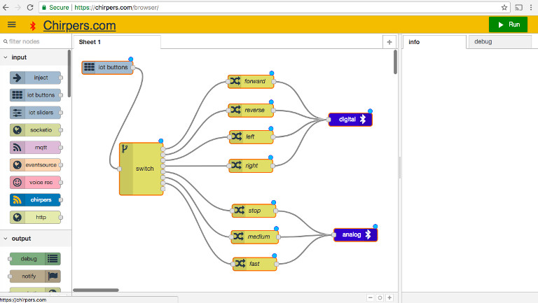
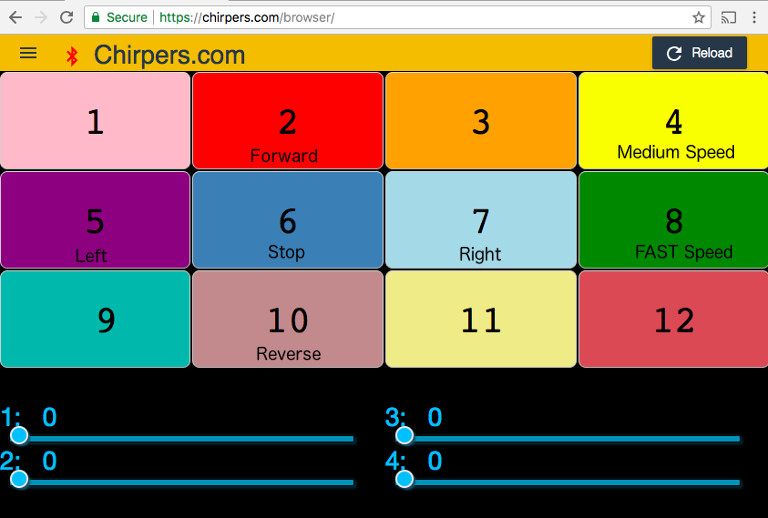
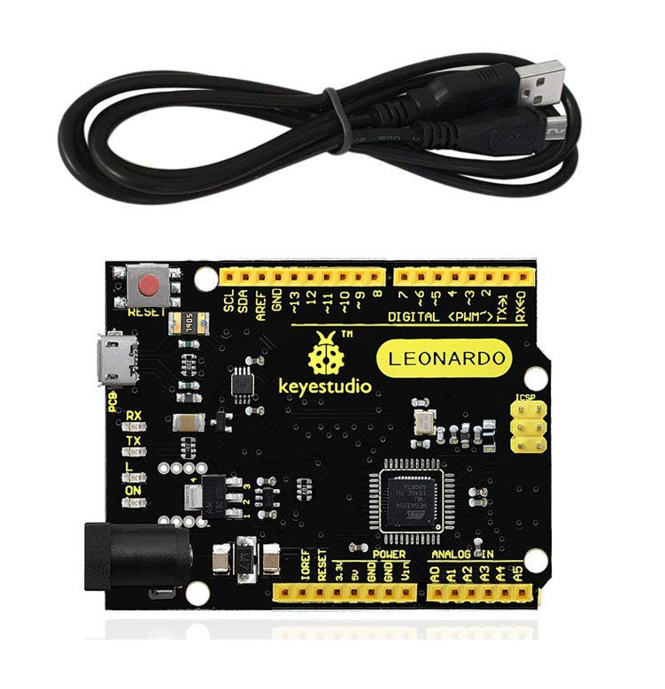

# Nodebots Day 2019

[](https://www.heatsynclabs.org)





## Our bots for today

* Custom Chassis
* Arduino Leonardo
* Continuous Motion Servo
* Batteries
* wheels
* Wires


[firmware](https://github.com/monteslu/webusb-serial/tree/master/example/sketch/StandardFirmataWebUSB)


## Connecting to the bot with Chirpers


[https://chirpers.com/browser](https://chirpers.com/browser)


## Controlling the bot

Switch to IOT Remote Buttons view in menu.


chirpers flow example for controlling bot:

```javascript
[{"id":"b189a025.5c5f5","type":"nodebot","z":"5ORdf9-2omU","name":"","username":"","password":"","boardType":"firmata","serialportName":"","connectionType":"webusb-serial","mqttServer":"","socketServer":"","pubTopic":"","subTopic":"","tcpHost":"","tcpPort":"","sparkId":"","sparkToken":"","beanId":"","impId":"","uuid":"","token":"","sendUuid":""},{"id":"NPwOexb8RuU","type":"servo","z":"5ORdf9-2omU","name":"left","pin":"5","upperRange":"","lowerRange":"","mode":"standard","controller":"","board":"b189a025.5c5f5","x":772,"y":930,"wires":[]},{"id":"DMIud8NBJCA","type":"servo","z":"5ORdf9-2omU","name":"right","pin":"3","upperRange":"","lowerRange":"","mode":"standard","controller":"","board":"b189a025.5c5f5","x":768,"y":1101,"wires":[]},{"id":"SIcWnPDfFIk","type":"servo","z":"5ORdf9-2omU","name":"weapon","pin":"9","upperRange":"","lowerRange":"","mode":"standard","controller":"","board":"b189a025.5c5f5","x":389,"y":789,"wires":[]},{"id":"BGXvkvRJEew","type":"inject","z":"5ORdf9-2omU","name":"","topic":"","payload":"0","payloadType":"num","repeat":"","crontab":"","once":false,"allowDebugInput":false,"x":178,"y":786,"wires":[["SIcWnPDfFIk"]]},{"id":"MhTpOIZgmtQ","type":"inject","z":"5ORdf9-2omU","name":"","topic":"","payload":"90","payloadType":"num","repeat":"","crontab":"","once":false,"allowDebugInput":false,"x":176,"y":834,"wires":[["SIcWnPDfFIk"]]},{"id":"MlTjAUJ2K_I","type":"inject","z":"5ORdf9-2omU","name":"","topic":"","payload":"180","payloadType":"num","repeat":"","crontab":"","once":false,"allowDebugInput":false,"x":176,"y":881,"wires":[["SIcWnPDfFIk"]]},{"id":"_Gl_veFGN5o","type":"iot buttons","z":"5ORdf9-2omU","x":119,"y":1012,"wires":[["iVtyHkBFAbw"]]},{"id":"iVtyHkBFAbw","type":"switch","z":"5ORdf9-2omU","name":"","property":"payload","propertyType":"msg","rules":[{"t":"eq","v":"2","vt":"num"},{"t":"eq","v":"10","vt":"num"},{"t":"eq","v":"7","vt":"num"},{"t":"eq","v":"5","vt":"str"},{"t":"eq","v":"6","vt":"num"}],"checkall":"true","outputs":5,"x":286,"y":979,"wires":[["ApqeLnQ_nuk","aOLtAb7yQNo"],["rUSQOX4wMDA","uvfd8brhC-k"],["aOLtAb7yQNo","uvfd8brhC-k"],["rUSQOX4wMDA","ApqeLnQ_nuk"],["kWrFKUVZwDI"]]},{"id":"kWrFKUVZwDI","type":"change","z":"5ORdf9-2omU","name":"stop 90","rules":[{"t":"set","p":"payload","pt":"msg","to":"90","tot":"num"}],"action":"","property":"","from":"","to":"","reg":false,"x":567,"y":1036,"wires":[["DMIud8NBJCA","NPwOexb8RuU"]]},{"id":"uvfd8brhC-k","type":"change","z":"5ORdf9-2omU","name":"180","rules":[{"t":"set","p":"payload","pt":"msg","to":"180","tot":"num"}],"action":"","property":"","from":"","to":"","reg":false,"x":582,"y":1168,"wires":[["DMIud8NBJCA"]]},{"id":"ApqeLnQ_nuk","type":"change","z":"5ORdf9-2omU","name":"0","rules":[{"t":"set","p":"payload","pt":"msg","to":"0","tot":"num"}],"action":"","property":"","from":"","to":"","reg":false,"x":580,"y":1108,"wires":[["DMIud8NBJCA"]]},{"id":"aOLtAb7yQNo","type":"change","z":"5ORdf9-2omU","name":"180","rules":[{"t":"set","p":"payload","pt":"msg","to":"180","tot":"num"}],"action":"","property":"","from":"","to":"","reg":false,"x":569,"y":968,"wires":[["NPwOexb8RuU"]]},{"id":"rUSQOX4wMDA","type":"change","z":"5ORdf9-2omU","name":"0","rules":[{"t":"set","p":"payload","pt":"msg","to":"0","tot":"num"}],"action":"","property":"","from":"","to":"","reg":false,"x":572,"y":884,"wires":[["NPwOexb8RuU"]]}]
```





# MIDI controller

* Leonardo - Micrcontroller
* buttons
* potentiometers
* wires




[MIDI firmware](midi_firmware)
